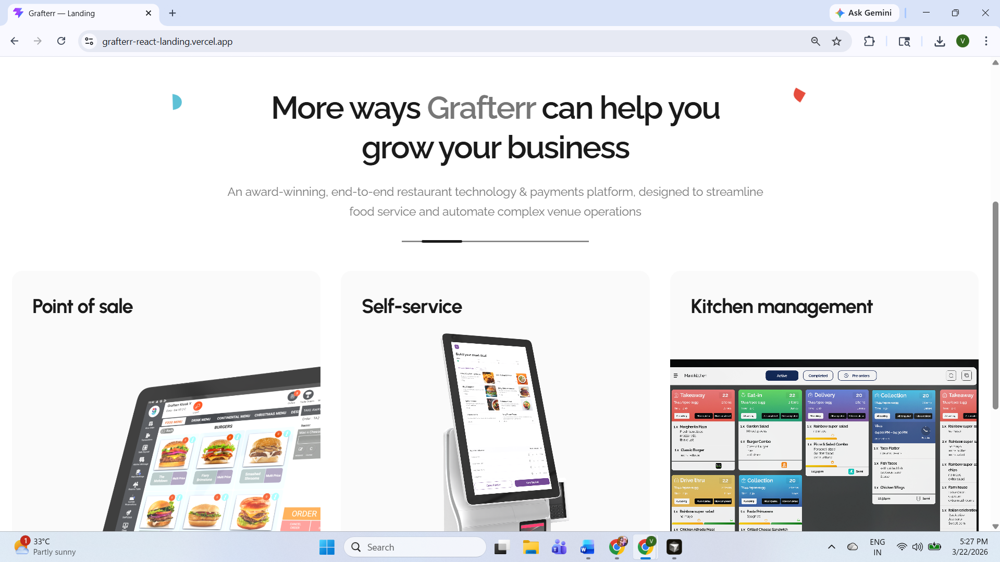
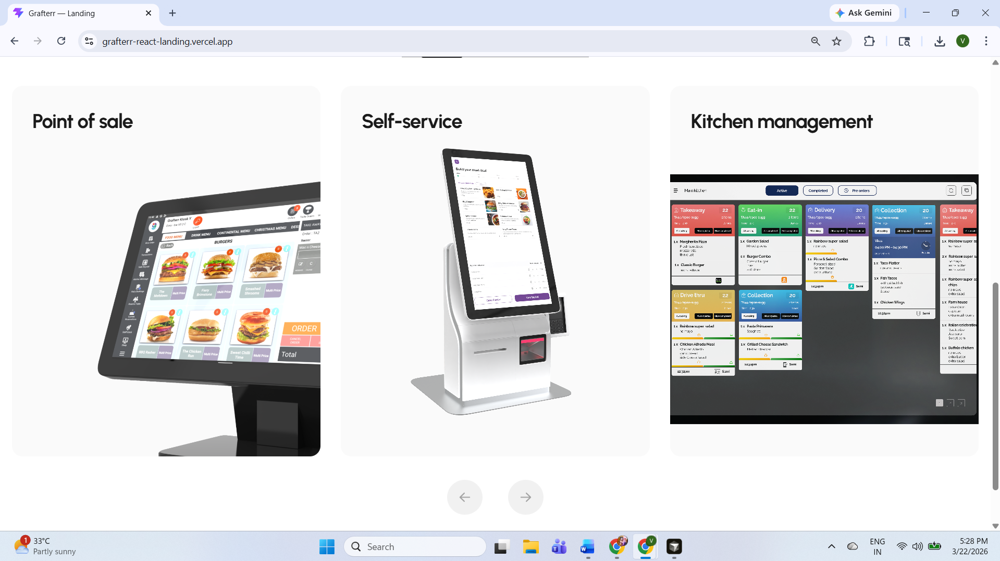
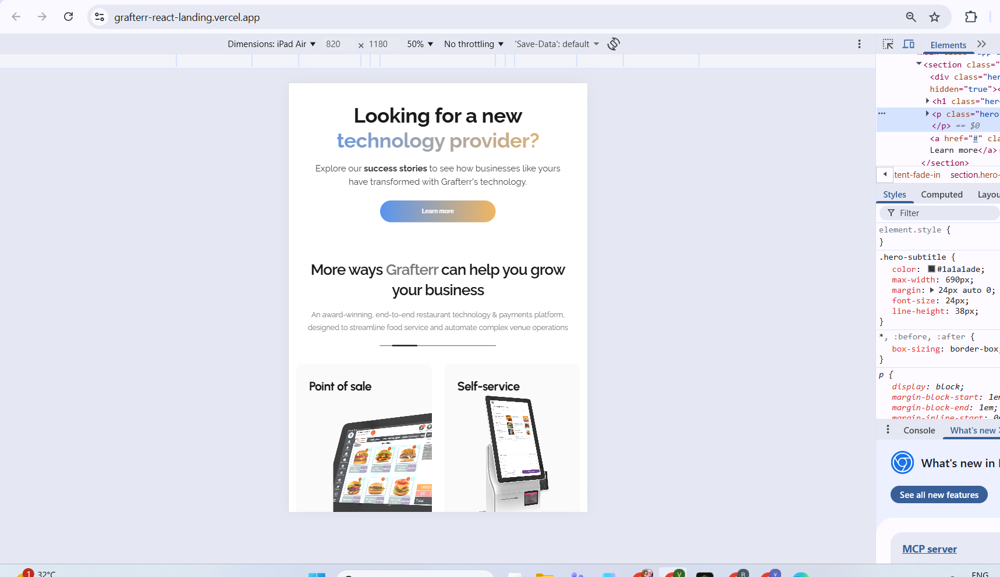
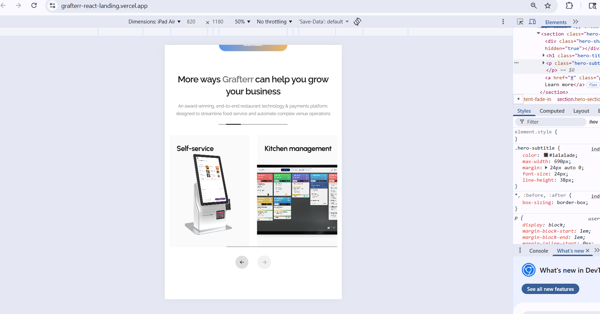
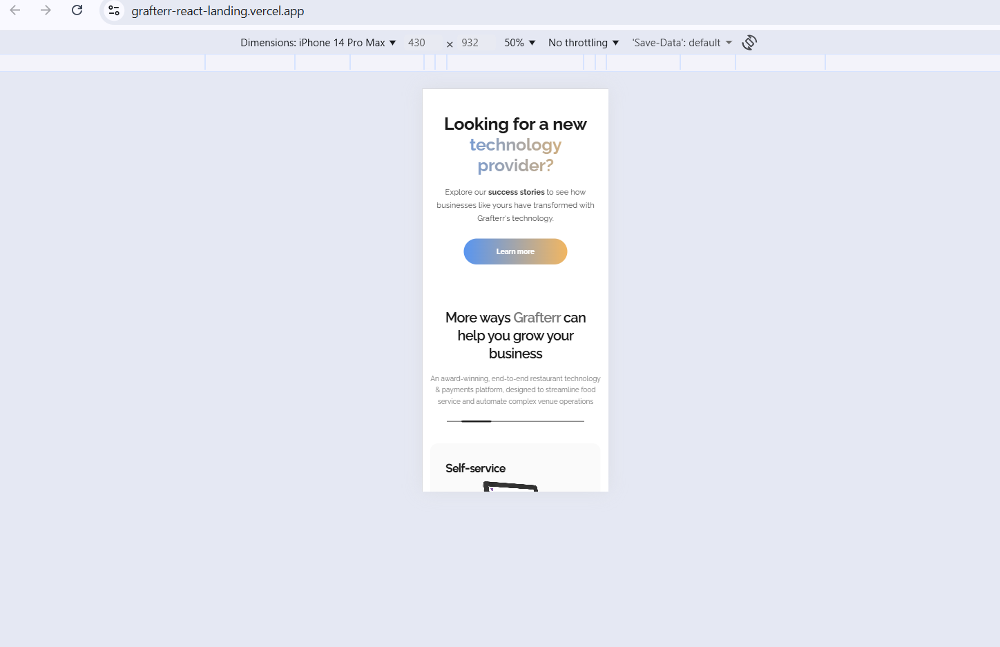
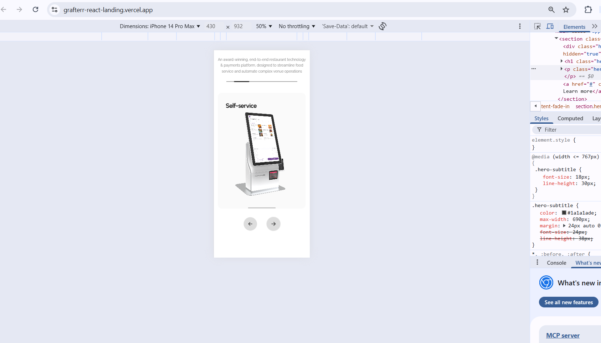
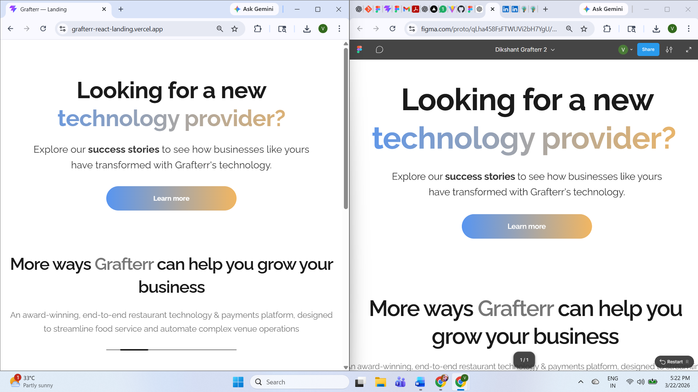

# Grafterr — Landing Page

A responsive marketing landing page built from a Figma design: **Hero** and **Features** sections with a product **carousel**, dynamic content, loading skeletons, and error handling with retry.

## Live site

**Deployed URL:** [https://grafterr-react-landing.vercel.app/](https://grafterr-react-landing.vercel.app/)

---

## Tech stack

| Area | Choice |
|------|--------|
| **UI library** | **React 18** (functional components only) |
| **Build tool** | [Vite](https://vitejs.dev/) |
| **Styling** | Plain CSS — `src/styles/variables.css` + `src/styles/global.css` (no Tailwind / Bootstrap) |
| **Language** | JavaScript (`.jsx`) |

This project uses **React**, not vanilla JS.

---

## Setup instructions

### Prerequisites

- **Node.js** 18+ (LTS recommended)
- **npm** (comes with Node)

### Install dependencies

```bash
cd graffter-landing-page
npm install
```

### Run locally (development)

```bash
npm run dev
```

Open the URL Vite prints (usually `http://localhost:5173`).

### Production build

```bash
npm run build
```

Output is written to `dist/`.

### Preview the production build locally

```bash
npm run preview
```

### Lint

```bash
npm run lint
```

---

## Approach

This implementation follows the project **requirement document** (`requirement.txt`): structure, data flow, and UI behavior.

### Architecture

- **Single source of truth:** All copy, images paths, carousel settings, and UI strings live in `src/data/content.json`. Nothing user-facing is hardcoded in JSX.
- **Simulated API:** `src/services/api.js` exposes `fetchHeroContent()` and `fetchFeaturesContent()` that return Promises with a **random delay between ~1000–1500 ms** (`setTimeout`), cloning JSON so the UI behaves like a real network call.
- **Custom hooks:**
  - **`useContent`** — loads hero + features + carousel + `ui` (error labels), manages **loading**, **error**, and **retry**.
  - **`useCarousel`** — tracks slide index, **responsive items per view** (desktop 3 / tablet 2 / mobile 1), **300 ms** eased scroll animation, **touch swipe** on the track, **prev/next** by one card, **disabled arrows** at the ends.
- **Composition:** Small UI pieces (`GradientText`, `GradientButton`, `FloatingShape`, `ProductCard`, `Carousel`, `Skeleton`) and section components (`HeroSection`, `FeaturesSection`) keep `App.jsx` thin.
- **Styling:** Global CSS with design tokens in `variables.css`; layout and components styled in `global.css` — **no inline styles** in components.

### Carousel behavior (summary)

- **Desktop (≥ 1200px):** 3 visible cards; arrows move **1 card** per click.
- **Tablet (768px–1199px):** 2 visible cards.
- **Mobile (&lt; 768px):** 1 card; **swipe** gestures enabled.
- Horizontal **scrollbar is hidden** in CSS; navigation uses arrows (and swipe on touch devices).

### Assets

- Images referenced from `content.json` under **`/images/...`** (files in `public/images/`).
- Screenshots for documentation live under **`public/screenshots/`**.

---

## Screenshots — completed sections

### Desktop (full page / key sections)






### Tablet





### Mobile





---

## Figma vs implementation

Side-by-side (or composite) comparison of the design and the built site:



*(Replace or regenerate this image in `public/screenshots/` if you update the design or the build.)*

---

## Project structure (high level)

```
graffter-landing-page/
├── public/
│   ├── images/           # Static images & SVGs
│   └── screenshots/      # README / submission screenshots
├── src/
│   ├── components/ui/    # Reusable UI
│   ├── sections/         # HeroSection, FeaturesSection
│   ├── hooks/            # useContent, useCarousel
│   ├── services/         # api.js (simulated API)
│   ├── data/             # content.json
│   ├── styles/           # variables.css, global.css
│   ├── App.jsx
│   └── main.jsx
├── requirement.txt
├── package.json
└── README.md
```

---

## License

Private / educational use unless otherwise specified by the author.
